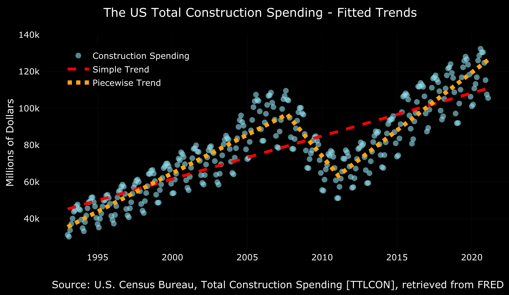

```{r, include = FALSE}
knitr::opts_chunk$set(
  collapse = TRUE,
  comment = "#>"
)
```

# 30DayChartChallenge

Code for the [#30DayChartChallenge](https://github.com/Z3tt/30DayChartChallenge_Collection2021)

### Day 1 | part-to-whole

[](https://github.com/RamiKrispin/30DayChartChallenge/blob/main/day1/part-to-whole.R)

### Day 2 | pictogram

[](https://github.com/RamiKrispin/30DayChartChallenge/blob/main/day2/pictogram.R)

### Day 3 | historical

[](https://github.com/RamiKrispin/30DayChartChallenge/blob/main/day3/historical.R)

### Day 4 | magic

[](https://github.com/RamiKrispin/30DayChartChallenge/blob/main/day4/magic.R)

### Day 5 | slope

[](https://github.com/RamiKrispin/30DayChartChallenge/blob/main/day5/slope.R)

### Day 6 | experimental

[](https://github.com/RamiKrispin/30DayChartChallenge/blob/main/day6/experimental.R)

### Day 7 | physical

[](https://github.com/RamiKrispin/30DayChartChallenge/blob/main/day7/physical.R)

### Day 8 | animals

[](https://github.com/RamiKrispin/30DayChartChallenge/blob/main/day8/animals.R)

### Day 9 | statistics

[](https://github.com/RamiKrispin/30DayChartChallenge/blob/main/day9/statistics.R)
